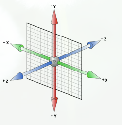

#### 1.导入方式

CSS样式可以写在哪些地方呢？从CSS 样式代码插入的形式来看基本可以分为以下3种：内联式、嵌入式和外部式三种。

##### 1.1 内联样式

内联式css样式,就是把css代码直接写在现有的HTML标签中，如下面代码：
```html
<p style="color:red">这里文字是红色。</p>
```
##### 1.2 嵌入式样式

嵌入式css样式，就是可以把css样式代码写在`<style type="text/css"></style>`标签之间。如下面代码实现把三个`<span>标签`中的文字设置为红色：

```html
<style type="text/css">
span{
	color:red;
}
</style>
```

嵌入式css样式必须写在`<style></style>`之间，并且一般情况下嵌入式css样式写在`<head></head>`之间。

##### 1.3 外部引入样式

外部式css样式(也可称为外联式)，就是把css代码写一个单独的外部文件中，这个css样式文件以".css"为扩展名，在`<head>`内（不是在`<style>`标签内）使用`<link>`标签将css样式文件链接到HTML文件内，如下面代码：

```html
<link href="base.css" rel="stylesheet" type="text/css" />
```
注意：
- css样式文件名称以有意义的英文字母命名，如base.css。
- rel="stylesheet" type="text/css" 是固定写法不可修改。
- `<link>标签`位置一般写在`<head>标签`之内。

#### 2.选择器

##### 1.`标签选择器` 
其实就是html代码中的标签。如右侧代码编辑器中的`<html>、<body>、<h1>、<p>、`。

##### 2.`类选择器`

在css样式编码中是最常用到的，如可以统一实现为“胆小如鼠”、“勇气”字体设置为红色。

语法：
```html
.类选器名称{css样式代码;}
```
注意：
- 英文圆点开头
- 其中类选器名称可以任意起名（但不要起中文）

使用方法：

第一步：使用合适的标签把要修饰的内容标记起来，如下：
```html
<span>胆小如鼠</span>
```
第二步：使用class="类选择器名称"为标签设置一个类，如下：
```html
<span class="stress">胆小如鼠</span>
```
第三步：设置类选器css样式，如下：
```css
.stress{color:red;}/*类前面要加入一个英文圆点*/
```

##### 3.`ID选择器`

- 使用ID选择器，必须给标签添加上id属性，为标签设置id="ID名称"，而不是`class="类名称"`。
- ID选择符的前面是井号`（#）`号，而不是英文圆点`（.）`。
- id属性的值即为当前标签的id，尽量见名思意，语义化。

类选择器和ID选择器的区别

相同点：
> 可以应用于任何元素

不同点：
> 1、ID选择器只能在文档中使用一次。与类选择器不同，在一个HTML文档中，ID选择器只能使用一次，而且仅一次。而类选择器可以使用多次。

> 2、可以使用类选择器词列表方法为一个元素同时设置多个样式。我们可以为一个元素同时设多个样式，但只可以用类选择器的方法实现，ID选择器是不可以的（不能使用 ID 词列表）。

##### 4.`子选择器`
子选择器，即大于符号(>), 用于选择指定标签元素的`第一代子元素`。如代码：

```css
.food>li{border:1px solid red;}
```
这行代码会使class名为food下的子元素li（水果、蔬菜）加入红色实线边框。

##### 5.`后代选择器`
后代选择器即包含选择器, 即加入空格; 用于选择指定标签元素下的后辈元素。如代码：

```css
.first  span{color:red;}
```
后代选择器与子选择器的区别，
> 1、子选择器（child selector）仅是指它的直接后代，或者你可以理解为作用于子元素的第一代后代。

> 2、而后代选择器是作用于所有子后代元素。后代选择器通过空格来进行选择，而子选择器是通过“>”进行选择。

**总结：** `>`作用于元素的`第一代后代`，`空格`作用于元素的`所有后代`。

##### 6.`伪类选择器`

伪类选择符，它允许给html不存在的标签（标签的某种状态）设置样式，比如说给html中一个标签元素的鼠标滑过的状态来设置字体颜色：

```css
a:hover{color:red;}
```
上面一行代码就是为`a标签`鼠标滑过的状态设置字体颜色变红。这样就会使第一段文字内容中的“胆小如鼠”文字加入鼠标滑过字体颜色变为红色特效。

关于伪类选择符，到目前为止，可以兼容所有浏览器的“伪类选择符”就是`a标签`上使用`:hover`。其实`:hover`可以放在任意的标签上，比如说 `p:hover`，但是它们的兼容性也是很不好的，所以现在比较常用的还是`a:hover`的组合。

##### 7.`分组选择器`
当想为html中多个标签元素设置同一个样式时，使用分组选择符`逗号,`，如下代码`h1、span标签`同时设置字体颜色为红色：

```css
h1,span{color:red;}
```
它相当于下面两行代码：
```css
h1{color:red;}
span{color:red;}
```

#### 3. 选择器分类总结

1. 元素选择器a{}
2. 伪元素选择器::before{}
3. 类选择器.link{}
4. 属性选择器[type=radio]{}
5. 伪类选择器:hover{}
6. ID选择器#id{}
7. 组合选择器[type=checkbox] + label{}
8. 否定选择器:not(.link){}
9. 通用选择器*{}

##### 3.1 选择器权重归纳

1. ID选择器#id{} +100
2. 类属性/伪类+10
3. 元素/伪元素+1
4. 其它选择器+0

说明
1. !important 优先级最高
2. 元素属性优先级高
3. 相同权重后写的生效

css的继承，优先级和重要性

##### 3.2 样式继承

> CSS的某些样式是具有继承性的，那么什么是继承呢？继承是一种规则，它允许样式不仅应用于某个特定html标签元素，而且应用于其后代。

比如下面代码：如某种颜色应用于p标签，这个颜色设置不仅应用p标签，还应用于p标签中的所有子元素文本，这里子元素为`span标签`。
```css
p{color:red;}
```
```html
<p>三年级时，我还是一个<span>胆小如鼠</span>的小女孩。</p>
```
可见p中的文本与span中的文本都设置为了红色。

> 但注意有一些css样式是不具有继承性的。如 border:1px solid red;

#####3.3 选择器优先级

1. 如果一个元素使用了多个选择器,则会按照选择器的优先级来给定样式。

2. 选择器的优先级依次是: `内联样式 > id选择器 > 类选择器 > 标签选择器 > 通配符选择器`

权重计算规则

`标签的权值为1，类选择符的权值为10，ID选择符的权值最高为100。` 例如下面的代码：
```css
p{color:red;} /*权值为1*/
p span{color:green;} /*权值为1+1=2*/
.warning{color:white;} /*权值为10*/
p span.warning{color:purple;} /*权值为1+1+10=12*/
#footer .note p{color:yellow;} /*权值为100+10+1=111*/
```
注意：

1. 还有一个权值比较特殊--继承也有权值但很低，有的文献提出它只有0.1，所以可以理解为继承的权值最低。

2. 权重叠加不会超过其级别，比如类选择器权值为10， 当同时存在11个类选择器及一个ID选择器时，并不是类选择器的权值 11*10 = 110 > ID选择器权值100, 实际上 此时类选择器11个还是更多个，它们叠加的权重计算永远会小于100， 所以此时ID选择器会生效;

有些特殊的情况需要为某些样式设置具有最高权值，怎么办？这时候可以使用`!important`来解决。

如下代码：
```css
p{color:red!important;}
p{color:green;}
```
```html
<p class="first">三年级时，我还是一个<span>胆小如鼠</span>的小女孩。</p>
```
这时 p 段落中的文本会显示的red红色。

注意：`!important`要写在分号的前面

**样式优先级为：** `浏览器默认的样式 < 网页制作者样式 < 用户自己设置的样式`，但记住`!important`优先级样式是个例外，权值高于用户自己设置的样式。

> 对于同一个元素同时用了上述三种方法(内联式、嵌入式、外部式样式) 设置css样式，那么哪种方法真正有效呢？

1. 相同权重下， 就近原则（离被设置元素越近优先级别越高）;
2. 不同权重下， 权重最高的样式生效; 

#### 4.非布局样式分类

1. 字体、字重、颜色、大小、行高(line-height)
2. 背景、边框
3. 滚动、换行
4. 粗体、斜体、下划线

#### 5.css字体样式

5类字体族  (字体族不要加引号)

1. serif  衬体；
2. sans-serif 非衬线字体;
3. monospace 等宽字体；
4. cursive  手写体；
5. fantasy 花体；

http://iconfont.cn  阿里巴巴 矢量图标库

设置字体

```css
body{font-family:"Microsoft Yahei”;}
```

设置大小
```css
body{font-size:12px;}
```

设置 粗体(bold), 斜体, 下划线, 正常(normal)
```css
p span{font-weight:bold;}
```
设置字体样式font-style属性

```css
<style type="text/css">
   p{
       font-style:oblique;
       font-weight:bold;
   }  
</style>
```

1. font-style可以设置字体样式，并且有种3设置方式。
2. 正常字体为normal,也是font-style的默认值。
3. italic为设置字体为斜体，用于字体本身就有倾斜的样式。
4. oblique为设置倾斜的字体，强制将字体倾斜。

设置颜色:  color属性
```css
p{color:red;}
```

字体样式
```css
body{
    font-style:italic;
    font-weight:bold; 
    font-size:12px; 
    line-height:1.5em; 
    font-family:"宋体",sans-serif;
}
```

可简写：

```css
body{
    font:italic  bold  12px/1.5em  "宋体",sans-serif;
}
```

注意：
1. 使用这一简写方式你至少要指定 `font-size` 和 `font-family` 属性，其他的属性(如 `font-weight、font-style、font-variant、line-height`)如未指定将自动使用默认值。
2. 在简写时 `font-size` 与 `line-height` 中间要加入“/”斜扛。

一般情况下因为对于中文网站，英文还是比较少的，所以下面简写代码比较常用：
```css
body{
    font:12px/1.5em  "宋体",sans-serif;
}
```
只是有字号、行间距、中文字体、英文字体设置。

#### 6.背景分类

1. 渐变色背景
2. 多背景叠加
3. 背景图片和属性(雪碧图) 所有图片都放在一张图片中 可以减少图片请求;
4. base64 和性能优化  (一般用在小图标等场景) 
5. 多分辨率适配

```css
.c3{
/* div的宽高 */
width:20px;
height:20px;
/* 背景图 */
background:url(./test_bg.png) no-repeat;
/* 背景图位置 */
background-position: -15px -10px;
/* 背景图大小 */
background-size: 261px 113px;
}
```
背景颜色
网页中的标签不论是行内元素还是块状元素都可以给它设置一个背景色。
为标签设置背景颜色可以使background-color:颜色值来实现。

#### 7.边框

线形，大小，颜色，边框背景图， 边框衔接 (round)

```css
.c2{
width:400px;
height: 200px;

/* 边框大小, 边框样式(solid,dotted,dashed), 颜色(red, transparent透明) */
border:30px solid transparent;

/* 图片, 像素大小，重复方式 repeater/round */
border-image:url(./border.png) 30 round;

}
```

#### 8.滚动行为

```css
.c1{
    background:red;
    height:200px;
    overflow: hidden;
}
```
overflow: visible, hidden,scroll,auto

#### 9. 文字折行

- overflow-wrap(word-wrap) 通用换行控制, 是否保留单词
- word-break 针对多字节文字, 中文句子也是单词
- white-space 空白处是否断行

```css
.c1{
border:1px solid;
width:8em;
overflow-wrap: normal;
word-break: normal;   //normal;  break-all:充许在单词内换行; keep-all:只能在半角空格或连字符处换行;
white-space: normal;  // normal, pre, nowrap,pre-wrap,pre-line,inherit;
}
```

#### 10. css3 文本样式

文本样式修饰:`text-decoration`
1. 默认值为none, 定义标准的文本。
2. underline为定义文本下的一条线。
3. overline为定义文本上的一条线。
4. line-through为定义穿过文本下的一条线，一般用于商品折扣价。
5. text-indent为文本添加首行缩进

中文文字中的段前习惯空两个文字的空白，这个特殊的样式可以用下面代码来实现：
```css
p{text-indent:2em;}
```

> 注意：2em的意思就是文字的2倍大小。

文字设置行间间距:`line-height`, 如下代码实现设置段落行间距为1.5倍。
```css
p{line-height:1.5em;}
```
使用`letter/word-spacing`增加或减少字符间的空白
如果想在网页排版中设置文字间隔或者字母间隔就可以使用l`etter-spacing `来实现，如下面代码：
```css
h1{
    letter-spacing:50px;
}
```
> 注意：这个样式使用在英文单词时，是设置字母与字母之间的间距。

单词间距设置：可以使用 `word-spacing` 来实现。如下代码：

```css
h1{
    word-spacing:50px;
}
```

使用`text-align`设置文本对齐方式
想为块状元素中的文本、图片设置居中样式吗？可以使用text-align样式代码
```css
h1{
    text-align:center;
}
```

> 注: `left, center, right` 分别表示 居左，居中，居右；

#### 11. 长度值
长度单位总结一下，目前比较常用到`px（像素）、em、% 百分比`，要注意其实这三种单位都是相对单位。

1、像素

像素为什么是相对单位呢？因为像素指的是显示器上的小点（CSS规范中假设“90像素=1英寸”）。实际情况是浏览器会使用显示器的实际像素值有关，在目前大多数的设计者都倾向于使用像素（px）作为单位。

2、em

就是本元素给定字体的 font-size 值，如果元素的 font-size 为 14px ，那么 1em = 14px；如果 font-size 为 18px，那么 1em = 18px。如下代码：

```css
p{font-size:12px;text-indent:2em;}
```

上面代码就是可以实现段落首行缩进 24px（也就是两个字体大小的距离）。

下面注意一个特殊情况：

但当给 font-size 设置单位为 em 时，此时计算的标准以 p 的父元素的 font-size 为基础。如下代码：

html:
`<p>以这个<span>例子</span>为例。</p>`

css:
```css
p{font-size:14px}
span{font-size:0.8em;}
```
结果 span 中的字体“例子”字体大小就为 11.2px（14 * 0.8 = 11.2px）。

3、百分比
`p{font-size:12px;line-height:130%}`
设置行高（行间距）为字体的130%（12 * 1.3 = 15.6px）。

#### 12. css3 盒模型
##### 12.1 元素分类
在讲解CSS布局之前，我们需要提前知道一些知识，在CSS中，html中的标签元素大体被分为三种不同的类型：块状元素、内联元素(又叫行内元素)和内联块状元素。

常用的块状元素有：

`<div>、<p>、<h1>...<h6>、<ol>、<ul>、<dl>、<table>、<address>、<blockquote> 、<form>`

常用的内联元素有：

`<a>、<span>、<i>、<em>、<strong>、<label>、<q>、<var>、<cite>、<code>`

常用的内联块状元素有：

`、<input>`

##### 12.2 块级元素
什么是块级元素？在html中`<div>、 <p>、<h1>、<form>、<ul>` 和 `<li>`就是块级元素。设置display:block就是将元素显示为块级元素。如下代码就是将内联元素a转换为块状元素，从而使a元素具有块状元素特点。

```css
a{display:block;}
```

块级元素特点：
1、每个块级元素都从新的一行开始，并且其后的元素也另起一行。（真霸道，一个块级元素独占一行）
2、元素的高度、宽度、行高以及顶和底边距都可设置。
3、元素宽度在不设置的情况下，是它本身父容器的100%（和父元素的宽度一致），除非设定一个宽度。

##### 12.3 内联元素
在html中，`<span>、<a>、<label>、<strong> `和`<em>`就是典型的内联元素（行内元素）（inline）元素。当然块状元素也可以通过代码display:inline将元素设置为内联元素。如下代码就是将块状元素div转换为内联元素，从而使 div 元素具有内联元素特点。

 ```css
 div{
     display:inline;
 }
 ```

内联元素特点：
1、和其他元素都在一行上；
2、元素的高度、宽度及顶部和底部边距不可设置；
3、元素的宽度就是它包含的文字或图片的宽度，不可改变。

内联元素之间有一个间距问题, 可以设置父元素font-size: 0;  来解决这个问题;

##### 12.4 内联块状元素

内联块状元素（inline-block）就是同时具备内联元素、块状元素的特点，

`display:inline-block`就是将元素设置为内联块状元素。

`、<input>`标签就是这种内联块状标签。

`inline-block` 元素特点：

1、和其他元素都在一行上；
2、元素的高度、宽度、行高以及顶和底边距都可设置。

`none`不占据位置

`display: none;`

none设置此元素不会被显示，当想要元素隐藏的时候可以使用此值。

> 一个元素实际宽度（盒子的宽度）=左边界+左边框+左填充+内容宽度+右填充+右边框+右边界。 高度也是如此;


盒子模型的边框就是围绕着内容及补白的线，这条线你可以设置它的粗细、样式和颜色(边框三个属性)。
如下面代码为 div 来设置边框粗细为 2px、样式为实心的、颜色为红色的边框：

```css
div{
    border:2px  solid  red;
}
```

上面是 border 代码的缩写形式，可以分开写：

```css
div{
    border-width:2px;
    border-style:solid;
    border-color:red;
}
```

注意：

1、border-style（边框样式）常见样式有：
dashed（虚线）| dotted（点线）| solid（实线）。

2、border-color（边框颜色）中的颜色可设置为十六进制颜色，如:

```css
border-color:#888;//前面的井号不要忘掉。
```
3、border-width（边框宽度）中的宽度也可以设置为：
thin | medium | thick（但不是很常用），最常还是用像素（px）。

如果有想为 p 标签单独设置下边框，而其它三边都不设置边框样式怎么办呢？css 样式中允许只为一个方向的边框设置样式：

```css
div{border-bottom:1px solid red;}
```
同样可以使用下面代码实现其它三边(上、右、左)边框的设置：

```css
border-top:1px solid red;
border-right:1px solid red; 
border-left:1px solid red;
```

使用border-radius设置圆角
元素边框的圆角效果可以使用border-radius属性来设置。圆角可分为左上、右上、右下、左下。如下代码：
```css
div{border-radius: 20px 10px 15px 30px;}
```
也可以分开写：
```css
div{
    border-top-left-radius: 20px;
   border-top-right-radius: 10px;
   border-bottom-right-radius: 15px;
   border-bottom-left-radius: 30px;
}
```
如果四个圆角都为10px;可以这么写：
```css
div{ border-radius:10px;}
```
如果左上角和右下角圆角效果一样为10px，右上角和左下角圆角一样为20px，可以这么写：
```css
div{ border-radius:10px 20px;}
```
需要特别注意的:一个正方形，当设置圆角效果值为元素宽度一半时，显示效果为圆形。

也可以写为百分比50%
```css
 div {
        width: 200px;
        height: 200px;
        border: 5px solid red;
        border-radius: 50%;
    }
```
元素内容与边框之间是可以设置距离的，称之为“内边距（填充）”。填充也可分为上、右、下、左(顺时针)。如下代码：
```css
div{padding:20px 10px 15px 30px;}
```
可以分开写上面代码：
```css
div{
   padding-top:20px;
   padding-right:10px;
   padding-bottom:15px;
   padding-left:30px;
}
```
如果上、右、下、左的填充都为10px;可以这么写
```css
div{padding:10px;}
```
如果上下填充一样为10px，左右一样为20px，可以这么写：
```css
div{padding:10px 20px;}
```
使用margin为盒子设置外边距（边界）
元素与其它元素之间的距离可以使用边界（margin）来设置。边界也是可分为上、右、下、左。如下代码：
```css
div{margin:20px 10px 15px 30px;}
```
也可以分开写：
```css
div{
   margin-top:20px;
   margin-right:10px;
   margin-bottom:15px;
   margin-left:30px;
}
```
如果上右下左的边界都为10px;可以这么写：
```css
div{ margin:10px;}
```
如果上下边界一样为10px，左右一样为20px，可以这么写：
```css
div{ margin:10px 20px;}
```
总结一下：padding和margin的区别，padding在边框里，margin在边框外。

#### 13. css3布局模型

常见的几类布局模型：

1、流动模型（Flow）
2、浮动模型 (Float) + margin
3、层模型（Layer）
4、table表格布局
5、inline-block布局
6、flexbox布局

##### 13.1 Flow模型

排队显示-流动模型
流动（Flow）是默认的网页布局模式。也就是说网页在默认状态下的 HTML 网页元素都是根据流动模型来分布网页内容的。

流动布局模型具有2个比较典型的特征：

第一点，块状元素都会在所处的包含元素内自上而下按顺序垂直延伸分布，因为在默认状态下，块状元素的宽度都为100%。实际上，块状元素都会以行的形式占据位置。
第二点，在流动模型下，内联元素都会在所处的包含元素内从左到右水平分布显示。（内联元素可不像块状元素这么霸道独占一行）
如标签a、span、em、strong都是内联元素。

##### 13.2 浮动模型
块状元素这么霸道都是独占一行，如果现在我们想让两个块状元素并排显示，怎么办呢？不要着急，设置元素浮动就可以实现这一愿望。

任何元素在默认情况下是不能浮动的，但可以用 CSS 定义为浮动，如 div、p、table、img 等元素都可以被定义为浮动。如下代码可以实现两个 div 元素一行显示。
```css
div{
    width:200px;
    height:200px;
    border:2px red solid;
    float:left;
}
<div id="div1"></div>
<div id="div2"></div>
```
当然也可以同时设置两个元素右浮动也可以实现一行显示。
```css
div{
    width:200px;
    height:200px;
    border:2px red solid;
    float:right;
}
```
设置两个元素一左一右可以实现一行显示吗？当然可以：
```css
div{
    width:200px;
    height:200px;
    border:2px red solid;
}
#div1{float:left;}
#div2{float:right;}
```

float 布局 脱离文档流；但不脱离文本流;

float 布局 , float 元素 会形成 "BFC 块", block flow control  使得inline 元素可以设置宽高;使得元素尽量靠上，靠左边 排列;

> float 元素会导致父级元素高度塌陷; 可以给父级元素加一个 overflow: auto;  也可以设置  overflow:hidden;

清除浮动的方式;

- 方式一: overflow: auto;  也可以设置  overflow:hidden;

- 方式二: 在父级元素的类上加一个样式 
```css
.container2::after{
    content: '';
    clear:both;
    display:block;
    visibility: hidden;
    height:0;
}
```

- 方式三: ::after{clear:both}

##### 13.3 层模型

如何让html元素在网页中精确定位，就像图像软件PhotoShop中的图层一样可以对每个图层能够精确定位操作。CSS定义了一组定位（positioning）属性来支持层布局模型。

position: 确定元素的位置
static/relative/absolute/fixed

absolute/fixed 是脱离文档流的， 不对别的元素定位造成影响; absolute 相对于父级absolute/relative来定位的; 如果都找不到 则相对于body 定位; 

如果设置了position:absolute  则 height 必须设置为具体的值 如height:200px;  此时设置百分比是不起作用的  height:100%; 

relative 是相对于自己原来的位置进行定位的; 

absolute 是相对于里自己最近的设置了position:absolute/relatvie属性的父级元素进行定位的； 如果找不到 则相对于body进行定位;
层级定位 z-index;

定位为relative/absolute/fixed 可以设置z-index  使得其可以在上面显示; 

###### 13.3.1 绝对定位

层模型之绝对定位

如果想为元素设置层模型中的绝对定位，需要设置position:absolute(表示绝对定位)，这条语句的作用将元素从文档流中拖出来，然后使用left、right、top、bottom属性相对于其最接近的一个具有定位属性的父包含块进行绝对定位。如果不存在这样的包含块，则相对于body元素，即相对于浏览器窗口。

如下面代码可以实现div元素相对于浏览器窗口向右移动100px，向下移动50px。
```css
div{
    width:200px;
    height:200px;
    border:2px red solid;
    position:absolute;
    left:100px;
    top:50px;
}
<div id="div1"></div>
```

效果如下，


###### 13.3.2 相对定位
如果想为元素设置层模型中的相对定位，需要设置position:relative（表示相对定位），它通过left、right、top、bottom属性确定元素在正常文档流中的偏移位置。相对定位完成的过程是首先按static(float)方式生成一个元素(并且元素像层一样浮动了起来)，然后相对于以前的位置移动，移动的方向和幅度由left、right、top、bottom属性确定，偏移前的位置保留不动。

如下代码实现相对于以前位置向下移动50px，向右移动100px;
```css
#div1{
    width:200px;
    height:200px;
    border:2px red solid;
    position:relative;
    left:100px;
    top:50px;
}
<div id="div1"></div>
```
效果图：


什么叫做“偏移前的位置保留不动”呢？


在右侧代码编辑器的19行div标签的后面加入一个span标签，在标并在span标签中写入一些文字。如下代码：
```css
<body>
    <div id="div1"></div><span>偏移前的位置还保留不动，覆盖不了前面的div没有偏移前的位置</span>
</body>
```
效果图：


从效果图中可以明显的看出，虽然div元素相对于以前的位置产生了偏移，但是div元素以前的位置还是保留着，所以后面的span元素是显示在了div元素以前位置的后面。

###### 13.3.3 固定定位

fixed:表示固定定位，与absolute定位类型类似，但它的相对移动的坐标是视图（屏幕内的网页窗口）本身。

由于视图本身是固定的，它不会随浏览器窗口的滚动条滚动而变化，除非你在屏幕中移动浏览器窗口的屏幕位置，或改变浏览器窗口的显示大小，因此固定定位的元素会始终位于浏览器窗口内视图的某个位置，不会受文档流动影响，这与background-attachment:fixed;属性功能相同。

以下代码可以实现相对于浏览器视图向右移动100px，向下移动50px。并且拖动滚动条时位置固定不变。
```css
#div1{
    width:200px;
    height:200px;
    border:2px red solid;
    position:fixed;
    left:100px;
    top:50px;
}
<p>文本文本文本文本文本文本文本文本文本文本文本文本文本文本文本文本文本文本文本文本文本文本文本文本文本文本文本文本文本文本文本文本文本文本。</p>
```

Relative与Absolute组合使用
使用position:absolute可以实现被设置元素相对于浏览器（body）设置定位以后，大家有没有想过可不可以相对于其它元素进行定位呢？答案是肯定的，当然可以。使用position:relative来帮忙，但是必须遵守下面规范：

1、参照定位的元素必须是相对定位元素的前辈元素：
```css
<div id="box1"><!--参照定位的元素-->
    <div id="box2">相对参照元素进行定位</div><!--相对定位元素-->
</div>
```
从上面代码可以看出box1是box2的父元素（父元素当然也是前辈元素了）。

2、参照定位的元素必须加入position:relative;
```css
#box1{
    width:200px;
    height:200px;
    position:relative;        
}
```

3、定位元素加入position:absolute，便可以使用top、bottom、left、right来进行偏移定位了。
```css
#box2{
    position:absolute;
    top:20px;
    left:30px;         
}
```
这样box2就可以相对于父元素box1定位了（这里注意参照物就可以不是浏览器了，而可以自由设置了）。

##### 13.4. flex 弹性模型

flex弹性盒子模型：

```diff
+ 1、设置display:flex属性可以把块级元素在一排显示。
+ 2、flex需要添加在父元素上，改变子元素的排列顺序。
+ 3、默认为从左往右依次排列,且和父元素左边没有间隙。
```

使用justify-content属性设置横轴排列方式

属性定义了项目在主轴上的对齐方式。属性值分别为：

```diff
+ justify-content: flex-start | flex-end | center | space-between | space-around;
```

使用align-items属性设置纵轴排列方式

属性定义了项目在交叉轴上的对齐方式。属性值分别为：

```diff
+ align-items: flex-start | flex-end | center | baseline | stretch;
```

给子元素设置flex占比, 设置子元素相对于父元素的占比。

flex:1 用来设置占用弹性盒子的百分比; 

固定像素 则可以这么设置:

```css
width: 70px;
flex:none;
```

技术点的解释：
```diff
+ 1、给子元素设置flex属性,可以设置子元素相对于父元素的占比。
+ 2、flex属性的值只能是正整数,表示占比多少。
+ 3、给子元素设置了flex之后,其宽度属性会失效。
```

```css
<style type="text/css">
    .box {
        height: 300px;
        background: blue;
        display: flex;
    }

    .box div {
        width: 200px;
        height: 200px;
    }
    
    .box1 {
        flex: 1;
        background: red;
    }
    
    .box2 {
        flex: 3;
        background: orange;
    }
    
    .box3 {
        flex: 2;
        background: green;
    }
    </style>
</head>

<body>
    <div class="box">
        <div class="box1">flex:1</div>
        <div class="box2">flex:3</div>
        <div class="box3">flex:2</div>
    </div>
</body>
```

水平居中设置-行内元素
在实际工作中常会遇到需要设置水平居中的场景，比如为了美观，文章的标题一般都是水平居中显示的。

这里又得分两种情况：行内元素 还是 块状元素 ，块状元素里面又分为定宽块状元素，以及不定宽块状元素。

下面了解一下行内元素怎么进行水平居中？
```diff
+ 如果被设置元素为文本、图片等行内元素时，水平居中是通过给父元素设置`text-align:center`来实现的。
```

(父元素和子元素：如下面的html代码中，div是“我想要在父容器中水平居中显示”这个文本的父元素。反之这个文本是div的子元素)如下代码：

html代码：
```html
<body>
  <div class="txtCenter">我想要在父容器中水平居中显示。</div>
</body>
```
css代码：
```css
<style>
  .txtCenter{
    text-align:center;
  }
</style>
```

水平居中设置-定宽块状元素

当被设置元素为 块状元素时用 text-align:center 就不起作用了，这时也分两种情况：定宽块状元素和不定宽块状元素。

定宽块状元素。(定宽块状元素：块状元素的宽度width为固定值。)

```diff
+ 满足定宽和块状两个条件的元素是可以通过设置“左右margin”值为“auto”来实现居中的。
```

html代码：
```css
<body>
  <div>我是定宽块状元素，哈哈，我要水平居中显示。</div>
</body>
```

css代码：
```css
<style>
div{
    border:1px solid red;/*为了显示居中效果明显为 div 设置了边框*/

    width:200px;/*定宽*/
    margin:20px auto;/* margin-left 与 margin-right 设置为 auto */
}
</style>
```
也可以写成:
```css
margin-left:auto;
margin-right:auto;
```
> 元素的"上下 margin"是可以随意设置的。 

##### 13.5 inline-block 布局 
display 
确定元素的显示类型
block/inline/inline-block

inline-block 需要处理的问题 
1.像文本一样排block元素
2.没有清除浮动等问题
3.需要处理间隙 (设置父级元素 font-size:0px;)

#### 14. 响应式设计与布局

主要处理屏幕大小问题;
主要方法:
1隐藏；
2折行；
3自适应空间 （rem/viewport/media query）;

1.实现两栏(三栏)布局的方法

 ```diff
+ 1.表格布局
+ 2.float + margin布局
+ 3.inline-block布局
+ 4.flexbox布局
 ```

2.position:absolute / fixed有什么区别?

```diff
+ 前者相对最近的absolute/relative
+ 后者相对屏幕(viewport)
```

#### 15. css 效果

##### 15.1 box-shadow 盒子投影

```css
.container{
background:red;
width:200px;
height:200px;
margin:100px;
/* box-shadow投影 偏移量(x,y), 阴影模糊区域的大小, 阴影扩展区域（不会模糊 而是实的) rgba 颜色值 透明度 */
box-shadow: 5px 5px 10px 0 rgba(0,0,0,.2);

/* inset 内阴影 */
box-shadow: inset 5px 5px 10px 0 rgba(0,0,0,0.2);

/* box-shadow 阴影扩展区 做边框，不占用实际像素 */
box-shadow: 0 0 0 5px green;

/* box-shadow 可以填写多组值 用逗号分割 */
box-shadow:200px 200px 0 5px green,
230px 200px 0 5px green,
215px 215px 0 -3px red;
}
```

营造层次感(立体感);
充当没有宽度的边框; 不会占据空间;
特殊效果; 做图案;
link: https://www.cnblogs.com/ranzige/p/4201647.html
link: https://www.zhangxinxu.com/wordpress/2019/01/pure-css-shapes/?shrink=1

##### 15.2 text-shadow 文本投影

```css
.container{
    margin:0 auto;
    max-width: 800px;
    font-size: 18px;
    line-height: 2em;
    font-family: STKaiti;
    /* (x,y) 水平/垂直投影, 模糊区域, 颜色;
    /* text-shadow: 1px 1px 0 #aaa; */
    /* text-shadow: 0 0 1px rgba(128,128,128,.2); */
    background: black;
    /* text-shadow: -1px -1px 0 white,
        -1px 1px 0 white,
        1px -1px 0 white,
        1px 1px 0 white; */
    /* text-shadow: 0 0 2px white; */
}
```

##### 15.3 border-radius 圆角

圆角矩形
圆形
半圆/扇形

```css
border-radius   x / y  水平方向/垂直方向 
border-radius 10px 10px 10px 10px / 20px 20px 20px 20px;
```

##### 15.4 background 

纹理, 图案
渐变
雪碧图动画
背景图尺寸适应

```css
background-size: cover 保持图片长宽比不变  覆盖整个容器元素; 超出的部分不显示; 
background-size: contain; 把背景图完整的显示出来， 长宽比不变；
```

##### 15.5 clip-path 
按照路径裁剪  裁剪的对象是容器;
对容器进行裁剪；
自定义路径; 
常见图形裁剪;
```css
//语法
   inset()可以传入5个参数，分别对应top,right,bottom,left的裁剪位置,round radius（可选，圆角）
//示例
   clip-path: inset(2em 3em 2em 1em round 2em);

//语法
circle( [ <shape-radius> ]? [ at <position> ]? )
//说明
circle()可以传人2个可选参数；
1. 圆的半径，默认元素宽高中短的那个为直径，支持百分比
2. 圆心位置，默认为元素中心点
//半径公式
如果半径使用百分比：圆的半径 = (sqrt(width^2+height^2)/sqrt(2)) * 百分比 


//示例
clip-path: circle(30% at 150px 120px);

//语法
ellipse( [ <shape-radius>{2} ]? [ at <position> ]? )
//说明
ellipse()可以传人3个可选参数；
1. 椭圆的X轴半径，默认是宽度的一半，支持百分比
2. 椭圆的Y轴半径，默认是高度的一半，支持百分比
3. 椭圆中心位置，默认是元素的中心点

//示例
clip-path: ellipse(45% 30% at 50% 50%);

//语法
polygon( <fill-rule>? , [ <length-percentage> <length-percentage> ]# )
//说明
<fill-rule>可选，表示填充规则用来确定该多边形的内部。可能的值有nonzero和evenodd,默认值是nonzero
后面的每对参数表示多边形的顶点坐标（X,Y），也就是连接点


//示例
clip-path: polygon(50% 0,100% 50%,0 100%);
```

clip-path练习:  https://www.cnblogs.com/liangdecha/p/9629150.html
clip-path 生成器: https://www.html.cn/tool/css-clip-path/


##### 15.6 3d变换 

2d变换 transform  (translate 位移; scale 缩放; skew 斜切; rotate 旋转)
translate(x,y):一个四边形，沿着X轴和Y轴移动。
rotate(angle):一个四边形，以中心点进行旋转。
rotateX(angle):一个四边形，围着与X轴平行的两条边中间的一条无形的边3D旋转。rotateY和rotateZ同理。
CSS3的斜切坐标系和数学中的坐标系完全不一样（设置斜切原点为左上角）


1、左手坐标系

伸出左手，让拇指和食指成“L”形，大拇指向右，食指向上，中指指向前方。这样我们就建立了一个左手坐标系，拇指、食指和中指分别代表X、Y、Z轴的正方向。如下图：


2、CSS3中的3D坐标系

CSS3中的3D坐标系与上面的左手坐标系有一定区别的，相当于其绕着X轴旋转了180度。



3、如何判断旋转角度：左手法则

左手握住旋转轴，竖起拇指指向旋转轴正方向，正向就是其余手指卷曲的方向（顺时针方向）。

> XYZ轴的正方向分别是：右、下、屏幕外，让轴正向对着自己，顺时针方向就是该轴旋转的方向。


4、透视 perspective

perspective 视距，表示视点距离屏幕的长短。视点，用于模拟透视效果时人眼的位置。


电脑显示屏是一个2D平面，图像之所以具有立体感（3D效果），其实只是一种视觉呈现，通过透视可以实现此目的。

透视可以将一个2D平面，在转换的过程当中，呈现3D效果。

> 并非任何情况下需要透视效果，根据开发需要进行设置。

比较通用的距离是设置为800px

perspective有两种写法

> a) 作为一个属性，设置给父元素，作用于所有3D转换的子元素

> b) 作为transform属性的一个值，做用于元素自身
```css
.class{
  perspective: 800px;
}
.class{
  transform: prespective(800px)
}
```

#### 16. CSS3 transform属性

应用于2D或3D转换，允许对元素进行倾斜、移动、缩放或旋转。
2D转换元素能够改变元素 x 和 y 轴，3D转换元素还能改变其Z轴。

```css
translate(x,y)
定义2D移动
translate3d(x,y,z) 
定义3D移动
translateX(x)
定义x轴的移动
translateY(x)
定义y轴的移动
translateZ(x)
定义z轴的3D移动
scale(x,y) 
定义2D缩放
scale3d(x,y,z) 
定义3D缩放
scaleX(x)
通过设置x轴的值定义缩放
scaleY(x)
通过设置y轴的值定义缩放
scaleZ(x)
通过设置z轴的值定义3D缩放
rotate(angle)
定义2D旋转
rotate3d(x,y,z,angle)
定义3D旋转
rotateX(angle)
定义沿着x轴的3D旋转
rotateY(angle)
定义沿着y轴的3D旋转
rotateZ(angle)
定义沿着z轴的3D旋转
skew(x-angle,y-angle) 
定义沿着x和y轴的2D倾斜
skewX(angle)
定义沿着x轴的2D倾斜
skewY(angle)
定义沿着y轴的2D倾斜
none    定义不进行转换
```

1.如何用一个div画XXX
- box-shadow无限投影
- ::before
- ::after

2.如何产生不占空间的边框
- box-shadow
- outline

3.如何实现半圆、扇形等图形
- border-radius组合;
- 有无边框
- 边框粗细
- 圆角半径


4.如果实现背景图居中显示/不重复/改变大小
- background-position
- background-repeat
- background-size(cover/contain)

5.如何平移/放大一个元素
- transform:translateX(100px)
- transform:scale(2)

6.如何实现3D效果
- perspective: 500px  (指定透视角度)
- transform-style: preserve-3d;  (变换3d效果)
- transform: translate rotate ...


#### 17. css 动画

css中的动画类型 
```diff
+ 1.transition 补间动画; 画面之间切换是css计算出来的; 
+ 2.keyframe 关键帧动画;
+ 3.逐帧动画
```

##### 17.1 补间动画

位置-平移
(left/right/margin/transform)
方位-旋转(transform)
大小-缩放(transform)
透明度(opacity)
其它-线性变换(transform)

```css
.container{
width:100px;
height:100px;
background:red;
/* all 表示应用所有能动的动画 */
transition: all 1s;

/* 应用多个动画 通过逗号分割 */
transition: width 1s, background 3s;

/* 动画应用函数 */
transition-timing-function: cubic-bezier(0.465, -0.460, 0.525, 1.435);

transition-timing-function: ease-in-out;

/* 动画延迟 开始和结束都会延迟 */
transition-delay: 1s;
}

.container:hover{
width:800px;
background:green;
}
```
transition 可以用逗号指定多个属性的动画; 
all 表示所有能动画的都加上动画; 

tansition-timing-function: 用来指定动画时间和进度的关系; 定义动画进度与时间的关系; 
linear: 线性的动画; 动画和进度是匀速的; 
easy-in-out: 开头结尾比较慢，中间快;

动画网址:   https://matthewlein.com/tools/ceaser

##### 17.2 keyframes动画

@keyframes keyframeName{}  定义keyframe

一进入这个元素就有动画;

可以按照百分比指定， 也可以指定特定的动画;

进度是完成可控制的；

定义更加灵活 
```css
.container{
width:100px;
height:100px;
background:red;
/* keyframe 名称， 时间, 动画函数 */
animation: run 1s linear;

/* none 不改变默认行为, forwards: 当动画完成后，保持最后一个属性值（在最后一个关键帧中定义） */
/* backwards: 在 animation-delay 所指定的一段时间内，在动画显示之前，应用开始属性值（在第一个关键帧中定义）。 */
/* both: 向前和向后填充模式都被应用。 */
animation-fill-mode: both;

/* infinite 无限循环 */
/* animation-iteration-count: infinite; */
/* 暂停, 可以通过js来启停 */
/* animation-play-state: paused; */
}
@keyframes run{

0%{
width: 100px;

}
50%{
width: 800px;

}
100%{
width:900px;
}
}
```
##### 17.3 逐帧动画 

> 适用于无法补间计算的动画 

animation-timing-function: steps(1)  两个帧之间需要几个动画， 1表示只需要1个动画; 

适用动画面积小，动画本身时长不是很大; 

1.CSS动画的实现方式有几种
- transition
- keyframes(animation)

2.过渡动画和关键帧动画的区别
- 过渡动画需要有状态变化
- 关键帧动画不需要状态变化
- 关键帧动画能控制更精细

3.如何实现逐帧动画
- 使用关键帧动画
- 去掉补间(steps)

4. CSS动画的性能
- 性能不坏
- 部分情况下优于JS
- 但JS可以做到更好
- 部分高危属性
- box-shadow等

#### 18. css 预处理器

- less 基于node.js写的; 编译速度快， 入门简单， 但是在处理复杂场景可能会比较棘手;

- sass /scss  基于ruby写的;

它们在特性上没有啥本质区别; 

CSS预处理器功能

```diff
+ 1.嵌套反映层级和约束
+ 2.变量和计算减少重复代码
+ 3.Extend和Mixin代码片段
+ 4.循环适用于复杂有规律的样式
+ 5.import CSS文件模块化
```

嵌套

less/sass 都支持嵌套; 

变量
```diff
+ less  定义变量用@符号;
```
```less
#定义变量 
@变量名 值;
#引用变量
@变量名
```
```diff
+ scss 定义变量用$符号;
```
```scss
#定义变量 
$变量名 值;
#引用变量
$变量名
```

mixin 

> 复用相同的样式;

less  mixin
```less
@fontSize: 12px;
@bgColor: red;

// 因为加上() 所以编译时不会单独生成对应的css
.mixinbox(){
font-size:13px;
}
// mixin 编译时会生成对应的css
.box{
color:green;
}
// mixin 多个参数用; 分割, 通过:value 设置默认值
.mixinconv(@color:red;@padding;@margin:2){
color:@color;
padding:@padding;
margin:@margin @margin @margin @margin;
}


.box1{
.box; //mixin

.mixinbox();
line-height:2em;
}

.box2{
.box(); //mixin .box() 与 .box 效果一样;

//.box;
line-height:3em;
}

// mixin;
.block(@fontSize){
font-size: @fontSize;
border: 1px solid #ccc;
border-radius: 4px;
}

body {
padding: 0;
margin: 0;
}

.wrapper{
    background:lighten(@bgColor, 40%);
    .nav{
        .block(@fontSize);
        // 如果没有默认值的参数， 则引用时必须填写;
        .mixinconv(@padding:2;@margin:5);
    }
    .content{
        .block(@fontSize + 2px);

        &:hover{
            background:red;
            }
        }
}
```

sass mixin
```scss
$fontSize: 12px;
$bgColor: red;

// 必须显示使用@mixin 声明一个mixin
// 多个变量用, 分割, 默认值用:冒号设置;
// 给其中变量设置值时， 可以用 $变量名:变量值 来单独设置某个变量的值
@mixin block($color:blue,$fontSize:16px){

font-size: $fontSize;

border: 1px solid #ccc;

border-radius: 4px;

color:$color;
}

body{
padding:0;
margin:0;
}

.wrapper{
background:lighten($bgColor,40%);
// 引用时 必须用 @include 显示引用;
@include block($bgColor);

.nav{
@include block($bgColor,$fontSize);

}
.content{
// @include block($fontSize:($fontSize +2px),$color:orange);
// 指定参数名称 传递参数值
@include block($fontSize:($fontSize +3px));

    &:hover{
        background:red;
        }
    }
}
```

extend 
> 复用相同代码;

> 与mixin 复用相同的样式的进一步的方式是 extend 会将相同的样式 集合成一个, 使得生成的css文件更小；

less extend

```less
// 扩展自.block mixin
// 扩展的mixin 是不能再次指定参数的
// 如.nav:extend(.mixinconv(@fontSize:16px)){} 这个是不对的，因为指定了参数;
.nav:extend(.block){
    color:#333;
    .mixinconv(@fontWeight:bold);
}
.content{
// 扩展的第二种写法 &:extend(.block)
    &:extend(.block);
    &:hover{
        background:red;
    }
}
```

sass extend
```scss
.nav{
    // 必须用@extend 显示声明扩展
    @extend .block;
    color:#333;
}
```

loop 

- 循环loop 时指按照一定的规则 生成一系列的css代码; 
- 复杂的动画效果，带延迟的，都可以通过循环的方式来处理的;

less 中loop
```less
.gen-col(@n) when (@n > 0 ){

    // 递归调用自己，每次参数减一;
    .gen-col(@n - 1);
    
    // 生成css
    .col-@{n}{
        width:1000px/12*@n;
    }
}

.gen-col(12);
```

> less 中不支持循环的语法， 只能用递归来做;

scss中 loop 

scss中 可以使用递归， 本身也提供for循环 如下， 比less 方便很多; 
```scss
// // @mixin 显示声明 mixin
// @mixin gen-col($n){
//     @if $n > 0 { // @if 条件判断
//         @include gen-col($n - 1); // @include 显示引用mixin
//         .col-#{$n}{
//             width: 1000px/12*$n;
//         }
//     }
// }


// // @include 显示引用mixin
// @include gen-col(12);


// @for 循环方式
@for $i from 1 through 12 {
    .col-#{$i}{
        width: 1000px/12*$i;

    }
}
```

import 

css 中的import 不会做合并，只能一个个加载，造成html 一个个去请求 性能存在问题; 

less import 可以将不同的文件import 后编译生成为一个; 

可以将css 组织的非常清晰， 然后通过import 组织起来即可; 

可以按照css 结构来组织代码 ， 而不需要考虑性能 一开始就要全部写在一起;
```less
@import "path/to/less/file" 
```
> 被别的less文件引用的文件要先@import 进来; 这个是有先后顺序的， 这就是说明 不能存在循环引用;

scss 中import 代码  跟less 基本一样;

#### 19. Bootstrap  

一个css 框架 twitter 出品, 提供了很多通用的基础样式;

bootstrap  v4.0 以上 是用sass 写的; 
bootstrap v4.0以下版本是用less写的; 

Bootstrap 风格定制; 
```diff
+ 1.使用css同名类覆盖; (要覆盖的类比较多， 容易出现问题);
+ 2.修改源码重新构建;  （基本上只需要修改变量即可, 比较推荐使用); 
+ 3.直接引用scss源文件，修改变量; 把Bootstrap 当做mixin来使用; (可以引入Bootstrap 然后通过变量覆盖， 这个最推荐, 可以按需引入相应的组件, 这个需要比较Bootstrap了解内部结构, 非常推荐， 系统也灰常干净);
```

Bootstrap如何实现响应式布局

原理:通过media query设置不同分辦率的class
使用:为不同分辨率选择不同的网格class

#### 20. Vue 样式解决方案

Vue避免css发送冲突的两种方式 

方案一:随机选择器

```css
#Scoped CSS
<style scoped></style>
```

#效果

```css
·<div abcdefg>
·div[abcdefg]{}
```

源码使用`<style scoped></style>`时， 则引用的时候,直接引用即可`class="demo"`
```css
<template>
  <div class="demo">Hello, I'm {{ name}}</div>
</template>

 <style  scoped>
.demo{
  color:red;
}
</style>
```

效果
```css
.demo[data-v-054b9c73] {
    color: red;
}
```

方案二:随机属性
```css
CSS modules
<style module></style>
```

源码当使用`<style module> </style>`时, 引用的地方应该写成`:class="$style.demo"`
```jsx
<template>
<div :class="$style.demo">Hello , I'm {{name}}</div>
</template>
```
```css
<style module> #这个module 就是打开css modules的使用方式; 
.demo{
  color:red;
}
</style>
```

效果
```css
._2sXkpinDnJhCrfFnntmavp_0 {
   color: red;
}
```


#### 21. React 中css解决方案

官方没有集成方案

社区方案众多 
- CSS modules
- (babel)react-css-modules
- styled components
- styled jsx

