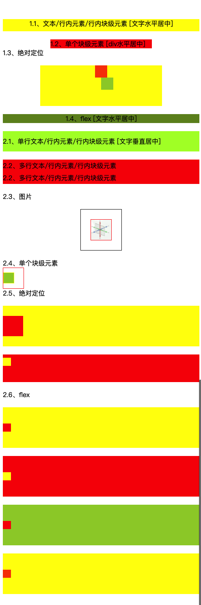

##### CSS 水平/垂直居中总结



[源码: css-middle](./layout/居中.html)

##### 一、水平居中

**1.1、文本/行内元素/行内块级元素**

**tips**：text-align只控制行内：文字、行内元素、行内块级元素，相对于它的块级父元素对齐。

```css
.view1_1{
            text-align:center;
}
```
> 只对行内内容有效；属性会继承影响到后代行内内容；
> 如果子元素宽度大于父元素宽度则无效;
> 只有后代行内内容中宽度小于设置text-align属性的元素宽度的时候，才会水平居中;

**1.2、单个块级元素**

**tips**：在margin有剩余时，并且如果左右margin设置了auto，那么将会均分剩余空间。此外，如果上下的margin设置了auto，其计算值则为0。

```css
.view1_2{
            width: 250px; /*必须定宽*/
            margin: 0 auto;
        }
```

> 必须固定宽度，且不能设置为auto；宽度要小于父元素，否则无效。

**1.3、绝对定位**

**tips**：

1、top、right、bottom、left的值是相对于父元素尺寸的
2、margin或者transform是相对于自身尺寸的二者组合，达到水平居中的目的

```css
.parent{
            height:100px;
            width:300px;
            position:relative;
            background:yellow;
        }
        .son{
            position:absolute;
            left:50%;
            transform: translateX(-50%); /*自身宽度一半, 等同于margin-left:-(width/2)*/
            height:30px;
            width:30px;
            background:orangered;
        }
        .son1{
            position:absolute;
            left:50%;
            top:30px;
            /* margin-left: -15px; */
            height:30px;
            width:30px;
            background: yellowgreen;
        }
```
> 使用margin-left需要先知道宽度；并且在IE9以下，使用transform兼容性不好。

1.4、flex

```css
.view1_3{
            display:flex;
            background:olivedrab;
            justify-content: center;
        }
```
> PC端、移动端的兼容性不好

```diff
+ key points:

- 对于水平居中，应该先考虑，哪些元素有自带的居中效果，
- 最先想到的应该就是 text-align:center了，
- 但是这个只对行内内容有效，所以要使用 text-align:center 
- 就必须将子元素设置为 display:inline; 
- 或者 display: inline-block;
- 其次就是考虑能不能用margin: 0 auto; 
- 因为这都是一两句代码能搞定的事，实在不行就是用绝对定位去实现了。
- 移动端能用flex就用flex，简单方便，灵活并且功能强大;
```

##### 二、垂直居中

**2.1、单行文本/行内元素/行内块级元素**

**tips**：line-height的最终表现是通过inline box实现的，而无论inline box所占据的高度是多少（无论比文字大还是比文字小），其占据的空间都是与文字内容公用水平中垂线的。

```css
.view2_1{
            height:50px;
            line-height:50px;
            background:greenyellow;
        }
```
> 只能用于单行行内内容；且需要先知道高度

**2.2、多行文本/行内元素/行内块级元素**

**tips**：也可以选择使用span把所有文字包裹起来，设置display：inline-block 用转换成图片的方式解决

```css
.view2_2{
            height: 60px;
            /*元素在页面呈现为5行, 则line-height的值为height/5 */
            line-height: 30px;
            background:red;
        }
```

2.3、图片

```css
.view2_3{
            height:100px;
            width:100px;
            border: 1px solid #000;
            position:relative;
        }
        .view2_3_1{
            width:50px;
            height:50px;
            position: absolute;
            top:50%;
            left:50%;
            transform: translate(-50%,-50%);
            border: 1px solid red;
        }
```

[实现div里的img图片水平垂直居中](https://blog.csdn.net/DreamFJ/article/details/68921957)

**2.4、单个块级元素**

```css
.view2_4{
            display:table-cell;
            vertical-align: middle;
            
            border: 1px solid red;
            height:50px;
            width:50px;
        }
        .view2_4_1{
            border:1px solid yellow;
            width:25px;
            height:25px;
            background:yellowgreen;
        }
```

> 设置tabl-cell的元素，宽度和高度的值设置百分比无效，需要给它的父元素设置display: table; 才生效。table-cell不感知margin，在父元素上设置table-row等属性，也会使其不感知height。设置float或position会对默认布局造成破坏，可以考虑为之增加一个父div定义float等属性；内容溢出时会自动撑开父元素。

**2.5、绝对定位**

**方法1**

**tips**：子绝父相，top、right、bottom、left的值是相对于父元素尺寸的，然后margin或者transform是相对于自身尺寸的，组合使用达到水平居中的目的

```css
.view2_5{
            height:100px;
            position:relative;
            background:yellow;
        }
        .view2_5_1{
            position:absolute;
            top:50%; /*父元素高度的一半，这里等同于top:50px; */
            transform: translateY(-50%); /*自身高度一半;*/
            height:50px;
            width:50px;
            background:red;
        }
```

> 使用margin-left需要先知道宽度；并且在IE9以下，使用transform兼容性不好。

**方法2**

**tips**：当top、bottom为0时,margin-top&bottom会无限延伸占满空间并且平分

```css
.view2_5_2{
            position:relative;

            height:100px;
            background:red;
        }
        .view2_5_2_1{
            position:absolute;
            margin:auto 0;
            top:0;
            bottom:0;

            height:20px;
            width:20px;
            background:yellow;

        }
```

**2.6、flex**

```css
# method 1
.view2_6_1{
    display:flex;
    align-items:center;
}

# method 2
.view2_6_2{
    display:flex;
}
.view2_6_2_1{
    align-self: center;
}

# method 3
.view2_6_3{
    display:flex;
}
.view2_6_3_1{
    margin:auto 0;
}

# method 4
.view2_6_4{
    display:flex;
    flex-direction: column;
    justify-content: center;
}
```

```diff
+ key points:

- 对于垂直居中，最先想到的应该就是 line-height 了，
- 但是这个只能用于行内内容；
- 其次就是考虑能不能用vertical-align: middle;
- 不过这个一定要熟知原理才能用得顺手，
- 建议看下vertical-align和line-height的基友关系；
- 然后便是绝对定位，虽然代码多了点，但是胜在适用于不同情况；
- 移动端兼容性允许的情况下能用flex就用flex
```