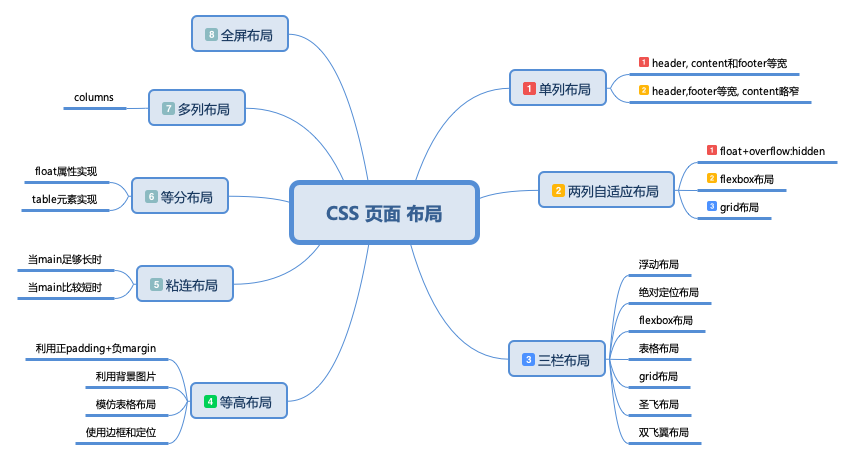

## CSS 页面布局

##### 单列布局
1.header, content 和 footer等宽

> 先通过对 header,content,footer 统一设置 width：1000px;或者 max-width：1000px(这两者的区别是当屏幕小于 1000px 时，前者会出现滚动条，后者则不会，显示出实际宽度);然后设置 margin:auto 实现居中即可得到。

- [1-column-layout01](./1-column-layout01.html)

2.header, footer 等宽, content略窄
  
> header、footer 的内容宽度不设置，块级元素充满整个屏幕，但 header、content 和 footer 的内容区设置同一个 width，并通过 margin:auto 实现居中。

- [1-column-layout02](./1-column-layout02.html)

##### 两列自适应布局
两列自适应布局是指一列由内容撑开，另一列撑满剩余宽度的布局方式

1.float+overflow:hidden

> 如果是普通的两列布局，浮动+普通元素的margin便可以实现，但如果是自适应的两列布局，利用float+overflow:hidden便可以实现，这种办法主要通过 overflow 触发 BFC,而 BFC 不会重叠浮动元素。

> 由于设置 overflow:hidden 并不会触发 IE6-浏览器的 haslayout 属性，所以需要设置 zoom:1 来兼容 IE6-浏览器。

> 如果侧边栏在右边时，注意渲染顺序。即在HTML中，先写侧边栏后写主内容

- [2-column-float](./2-column-float.html)

2.Flexbox 布局

- [2-column-flex](./2-column-flex.html)

3.Grid 布局

- [2-column-grid](./2-column-grid.html)

link 
- [CSS 网格布局](https://www.cssjs.cn/doc/7/134.html)

##### 三栏布局

> 中间列自适应宽度，旁边两侧固定宽度，实现三栏布局有多种方式

1.浮动布局

> 浮动布局的优点就是比较简单，兼容性也比较好。但浮动布局是有局限性的，浮动元素脱离文档流，要做清除浮动，这个处理不好的话，会带来很多问题，比如父容器高度塌陷等。

- [3-column-float](./3-column-float.html)

2.绝对定位布局

- [3-column-position](./3-column-position.html)

position:absolute

- 设置为绝对定位的元素框从文档流完全删除，并相对于其包含块定位，包含块可能是文档中的另一个元素或者是初始包含块。
- 元素原先在正常文档流中所占的空间会关闭，就好像该元素原来不存在一样。
- 元素定位后生成一个块级框，而不论原来它在正常流中生成何种类型的框。

> 绝对定位布局优点就是快捷，设置很方便，而且也不容易出问题。缺点就是，容器脱离了文档流，后代元素也脱离了文档流，高度未知的时候，会有问题，这就导致了这种方法的有效性和可使用性是比较差的。

float情况下

- 浮动的框可以向左或向右移动，直到它的外边缘碰到包含框或另一个浮动框的边框为止。
- 由于浮动框不在文档的普通流中，所以文档的普通流中的块框表现得就像浮动框不存在一样。

3.flexbox三栏布局

- [3-column-flexbox](./3-column-flexbox.html)

flexbox三栏布局解决了position:absolute和float布局的不足，是比较完全的解决方案，目前移动端布局也采用flexbox布局;
