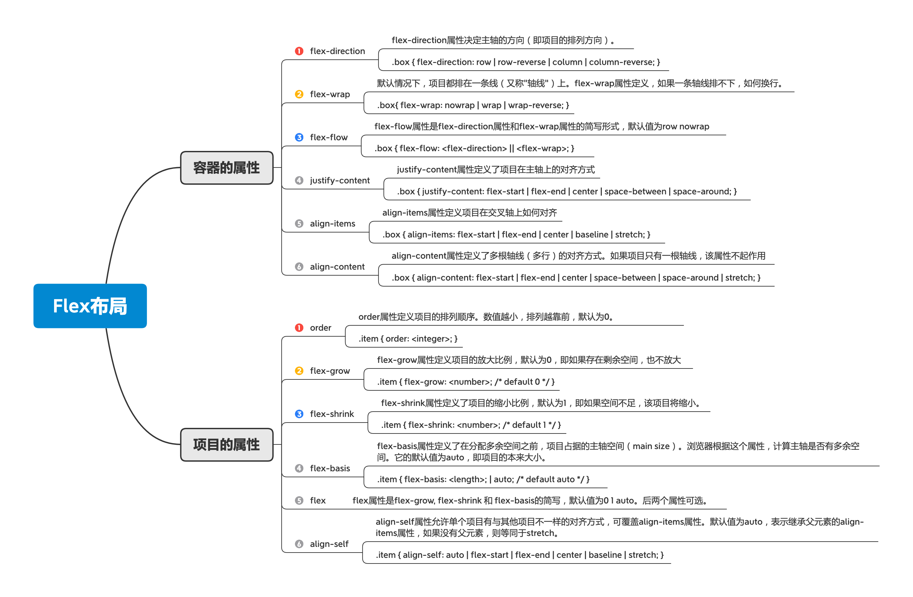
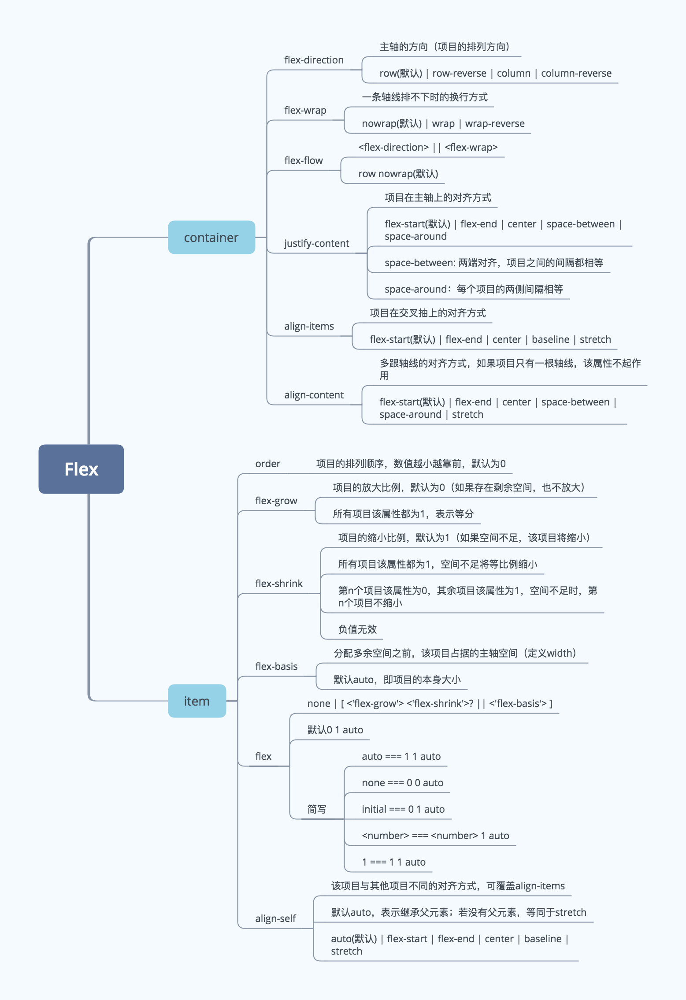
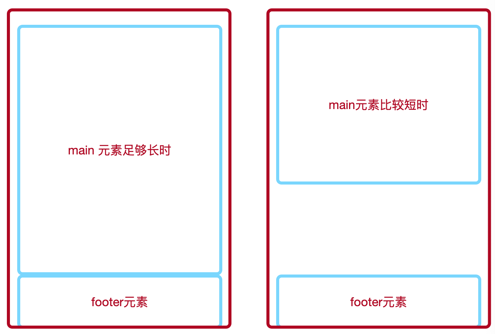
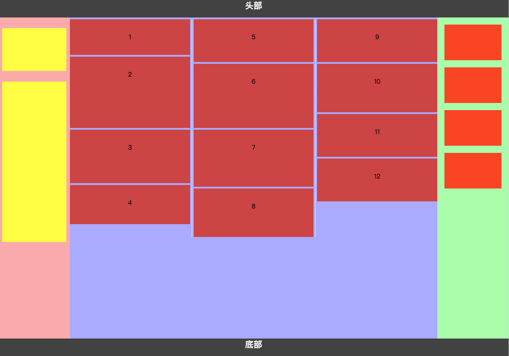
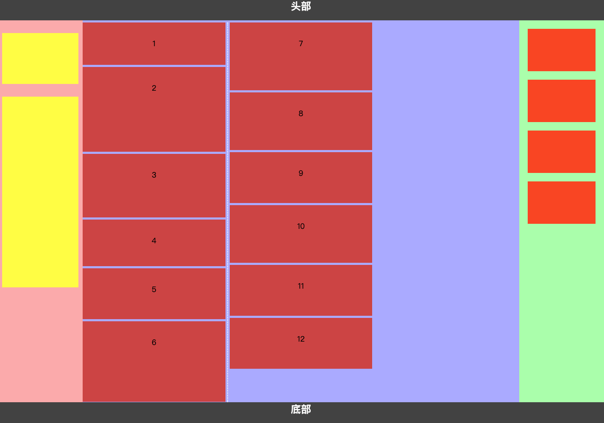

## CSS 页面布局




##### 单列布局
1.header, content 和 footer等宽

> 先通过对 header,content,footer 统一设置 width：1000px;或者 max-width：1000px(这两者的区别是当屏幕小于 1000px 时，前者会出现滚动条，后者则不会，显示出实际宽度);然后设置 margin:auto 实现居中即可得到。

- [1-column-layout01](./1-column-layout01.html)

2.header, footer 等宽, content略窄
  
> header、footer 的内容宽度不设置，块级元素充满整个屏幕，但 header、content 和 footer 的内容区设置同一个 width，并通过 margin:auto 实现居中。

- [1-column-layout02](./1-column-layout02.html)

##### 两列自适应布局
两列自适应布局是指一列由内容撑开，另一列撑满剩余宽度的布局方式

1.float+overflow:hidden

> 如果是普通的两列布局，浮动+普通元素的margin便可以实现，但如果是自适应的两列布局，利用float+overflow:hidden便可以实现，这种办法主要通过 overflow 触发 BFC,而 BFC 不会重叠浮动元素。

> 由于设置 overflow:hidden 并不会触发 IE6-浏览器的 haslayout 属性，所以需要设置 zoom:1 来兼容 IE6-浏览器。

> 如果侧边栏在右边时，注意渲染顺序。即在HTML中，先写侧边栏后写主内容

- [2-column-float](./2-column-float.html)

> 子元素设置float属性后，通常需要在其父元素设置清除浮动的样式，即在父元素添加一个.clearfix的类，样式为

```css
.clearfix::after{
   content: '';
   display: block;
   clear: both;
}
```

- [2-column-float-clearfix](./2-column-float-clearfix.html)

由此可见解决父元素没有高度的两种方式
```diff
+ 父元素设置 overflow:hidden;
+ 父元素设置 clearfix;
```

左侧固定，右侧自适应布局（float + margin）

- [2-column-margin-left](./2-column-margin-left.html)

左侧左浮动，右侧设置margin-left

- [2-column-margin-right](./2-column-margin-right.html)

利用浮动和负外边距来进行左边固定右边自适应的布局


2.Flexbox 布局

- [2-column-flex](./2-column-flex.html)

```diff
- 注意，设为 Flex 布局以后，子元素的float、clear和vertical-align属性将失效。
```

3.Grid 布局

- [2-column-grid](./2-column-grid.html)

link 
- [CSS 网格布局](https://www.cssjs.cn/doc/7/134.html)

##### 三栏布局

> 中间列自适应宽度，旁边两侧固定宽度，实现三栏布局有多种方式

> 左中右布局的实现由很多种，大体可分为传统的浮动+margin和绝对定位+margin，现代比较“潮”的flex弹性盒子布局，以及科技含量更高的Grid布局。

1.浮动布局

> 浮动布局的优点就是比较简单，兼容性也比较好。但浮动布局是有局限性的，浮动元素脱离文档流，要做清除浮动，这个处理不好的话，会带来很多问题，比如父容器高度塌陷等。

- [3-column-float](./3-column-float.html)
  
- [3-column-float-margin](./3-column-float-margin.html)

> float + margin, 左栏左浮动，右栏右浮动，主体直接放后面，就实现了自适应三栏布局。这种布局需要注意主体main标签必须放在最后，左右随意，一定要注意div书写的顺序。

- [3-column-float-margin-left](./3-column-float-margin-left.html)

> 浮动+margin负值法, 

首先，中间的主体要使用双层标签。外层div宽度100%显示，并且浮动，内层div为真正的主体内容，含有左右210像素的margin值。左栏与右栏都是采用margin负值定位的，左栏左浮动，margin-left为-100%，由于前面的div宽度100%与浏览器，所以这里的-100% margin值正好使左栏div定位到了页面的左侧；右侧栏也是左浮动，其margin-left也是负值，大小为其本身的宽度即200像素。

2.绝对定位布局

- [3-column-position](./3-column-position.html)

position:absolute

- 设置为绝对定位的元素框从文档流完全删除，并相对于其包含块定位，包含块可能是文档中的另一个元素或者是初始包含块。
- 元素原先在正常文档流中所占的空间会关闭，就好像该元素原来不存在一样。
- 元素定位后生成一个块级框，而不论原来它在正常流中生成何种类型的框。

> 绝对定位布局优点就是快捷，设置很方便，而且也不容易出问题。缺点就是，容器脱离了文档流，后代元素也脱离了文档流，高度未知的时候，会有问题，这就导致了这种方法的有效性和可使用性是比较差的。

> 缺点: 当父元素有内外边距时，会导致中间栏的位置出现偏差;

float情况下

- 浮动的框可以向左或向右移动，直到它的外边缘碰到包含框或另一个浮动框的边框为止。
- 由于浮动框不在文档的普通流中，所以文档的普通流中的块框表现得就像浮动框不存在一样。

- [3-column-position-margin](./3-column-position-margin.html)


3.flexbox三栏布局

- [3-column-flexbox](./3-column-flexbox.html)

flexbox三栏布局解决了position:absolute和float布局的不足，是比较完全的解决方案，目前移动端布局也采用flexbox布局;



> 给父元素（Flex容器）设置 display:flex；子元素（Flex项目）会默认排成一行，通过设置容器或项目的各种属性来改变项目布局的方式。

```css
.father{
  display: flex;
  justify-content:space-between; /*居中*/
}
```

4.表格布局

- [3-column-table](./3-column-table.html)
  
> 表格布局的兼容性很好，在 flex 布局不兼容的时候，可以尝试表格布局。当内容溢出时会自动撑开父元素。

5.网格布局

- [3-column-grid](./3-column-grid.html)

- CSS Grid 是创建网格布局最强大和最简单的工具。就像表格一样，网格布局可以让 Web 设计师根据元素按列或行对齐排列，但他和表格不同，网格布局没有内容结构，从而使各种布局不可能与表格一样。例如，一个网格布局中的子元素都可以定位自己的位置，这样他们可以重叠和类似元素定位。

> 但网格布局的兼容性不好。IE10+上支持，而且也仅支持部分属性。

6.圣杯布局

> 比较特殊的三栏布局，同样也是两边固定宽度，中间自适应，唯一区别是 dom 结构必须是先写中间列部分，这样实现中间列可以优先加载。

- [圣杯布局](./3-column-圣杯布局.html)

实现步骤
1.三个部分都设定为左浮动，否则左右两边内容上不去，就不可能与中间列同一行。然后设置 center 的宽度为 100%(实现中间列内容自适应)，此时，left 和 right 部分会跳到下一行;

2.通过设置 margin-left 为负值让 left 和 right 部分回到与 center 部分同一行;

3.通过设置父容器的 padding-left 和 padding-right，让左右两边留出间隙。

4.通过设置相对定位，让 left 和 right 部分移动到两边。

缺点
- center 部分的最小宽度不能小于 left 部分的宽度，否则会 left 部分掉到下一行
- 如果其中一列内容高度拉长，其他两列的背景并不会自动填充。(借助等高布局正padding+负margin可解决)


7.双飞翼布局

> 同样也是三栏布局，在圣杯布局基础上进一步优化，解决了圣杯布局错乱问题，实现了内容与布局的分离。而且任何一栏都可以是最高栏，不会出问题。

- [双飞翼布局](./3-column-双飞翼布局.html)

实现步骤

(前两步与圣杯布局一样)
3.三个部分都设定为左浮动，然后设置 center 的宽度为 100%，此时，left 和 right 部分会跳到下一行；
4.通过设置 margin-left 为负值让 left 和 right 部分回到与 center 部分同一行；
5.center 部分增加一个内层 div，并设 margin: 0 200px；

缺点

> 多加一层 dom 树节点，增加渲染树生成的计算量。

圣杯布局和双飞翼布局实现方式对比:

- 两种布局方式都是把主列放在文档流最前面，使主列优先加载。
  
- 两种布局方式在实现上也有相同之处，都是让三列浮动，然后通过负外边距形成三列布局。
  
- 两种布局方式的不同之处在于如何处理中间主列的位置: 圣杯布局是利用父容器的左、右内边距+两个从列相对定位; 双飞翼布局是把主列嵌套在一个新的父级块中利用主列的左、右外边距进行布局调整

- 双飞翼布局只需要包裹中间列即可，而圣杯布局要包裹三列;

- 双飞翼布局使用margin , 而圣杯布局用的是padding 为左右留出空间;

##### 等高列布局

> 等高布局是指子元素在父元素中高度相等的布局方式。等高布局的实现包括伪等高和真等高,伪等高只是看上去等高而已,真等高是实实在在的等高。

1.利用背景图片
2.利用正padding+负margin
3.模仿表格
4.使用边框和定位

> 上述几种方式都不太理想;

##### 粘连布局

- 有一块内容<main>，当<main>的高康足够长的时候，紧跟在<main>后面的元素<footer>会跟在<main>元素的后面。

- 当<main>元素比较短的时候(比如小于屏幕的高度),期望这个<footer>元素能够“粘连”在屏幕的底部



步骤:

1.footer 必须是一个独立的结构，与 wrap 没有任何嵌套关系

2.wrap 区域的高度通过设置 min-height，变为视口高度

3.footer 要使用 margin 为负来确定自己的位置

4.在 main 区域需要设置 padding-bottom。这也是为了防止负 margin 导致 footer 覆盖任何实际内容。

##### 复杂布局





[css 多列布局 column-fill](https://developer.mozilla.org/zh-CN/docs/Web/CSS/column-fill)

[七个你可能不了解的CSS单位](https://www.w3cplus.com/css/7-css-units-you-might-not-know-about.html)

[CSS 定位详解](https://www.ruanyifeng.com/blog/2019/11/css-position.html)

[Flex 布局示例](http://static.vgee.cn/static/index.html)

[Flex 布局教程：实例篇](http://www.ruanyifeng.com/blog/2015/07/flex-examples.html)