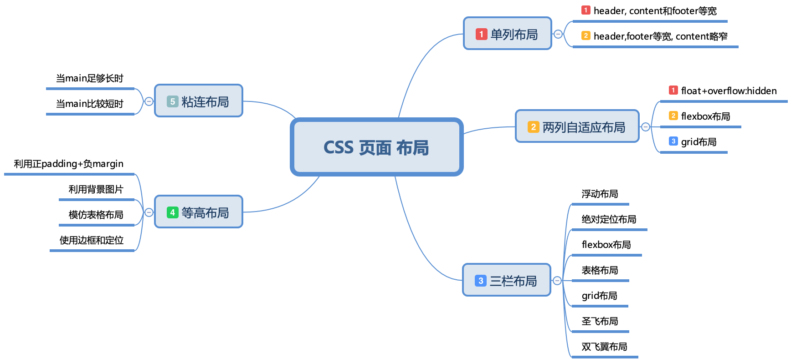

## CSS 页面布局

##### 单列布局
1.header, content 和 footer等宽

> 先通过对 header,content,footer 统一设置 width：1000px;或者 max-width：1000px(这两者的区别是当屏幕小于 1000px 时，前者会出现滚动条，后者则不会，显示出实际宽度);然后设置 margin:auto 实现居中即可得到。

[1-column-layout01](./1-column-layout01.html)

2.header, footer 等宽, content略窄
  
> header、footer 的内容宽度不设置，块级元素充满整个屏幕，但 header、content 和 footer 的内容区设置同一个 width，并通过 margin:auto 实现居中。

[1-column-layout02](./1-column-layout02.html)