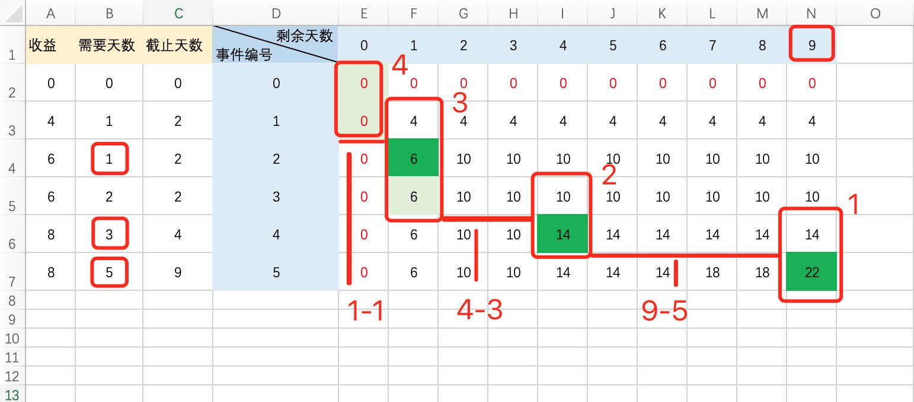

[PAT顶级 1002 Business (35分) 排序+01背包](https://blog.csdn.net/weixin_44123362/article/details/104204354)
[PAT T1002 Business (35分)](https://blog.csdn.net/kyln1039/article/details/103940474)

题意: 开始做事时, 所有事情的截止日期开始计数, 

所以事情能做要满足一个条件

```
min(剩余天数, 截止时间) - 实际需要时间 >=0 
```



逆推路径

从 dp[5][9] 开始逆推, 

如图1 dp[5][9] - dp[4][9] > 0, 所以 事件编号5 做了, 

因为做完事件编号5，需要花费5天时间，所以事件编号4从 剩余的4天中去做，

在剩余的4天中做事件编号4的收益如图2, 14 - 10 > 0, 所以 事件编号4 做了，

上述做了事件编号5，4 则花了8天时间, 

目前只剩余1天事件， 显然事件编号3需要2天才能做完， 所以此时事件编号3不能做了， 如图3， 6-6=0，

再来看看事件编号2 需要1天做完, 如图3， 发现 6-4 >0 , 所以事件编号2做了, 

做完事件5，4，2号后 剩余0天，计算公式来到如图4， 0-0；
