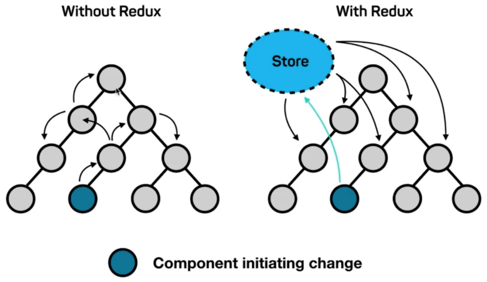
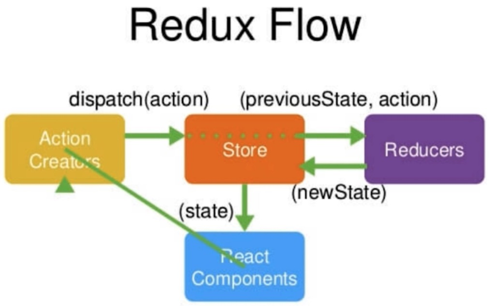

Redux 
Redux 是 JavaScript 状态容器，提供可预测化的状态管理。

一个组件改变了store中的内容， 其它的组件感知到store中数据的变化，从而自动到store中来取最新的数据;

> https://www.redux.org.cn/

Redux 工作流程

- Store 存储数据的公共区域; (图书馆管理员)
- React Components （借书的用户)
- Action Creators (说的要借什么书的这句话)
- Reducers (记录本)
